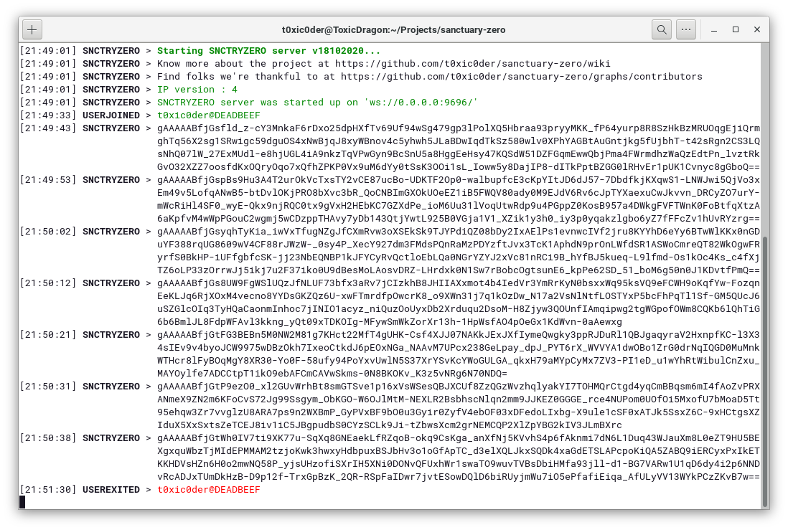
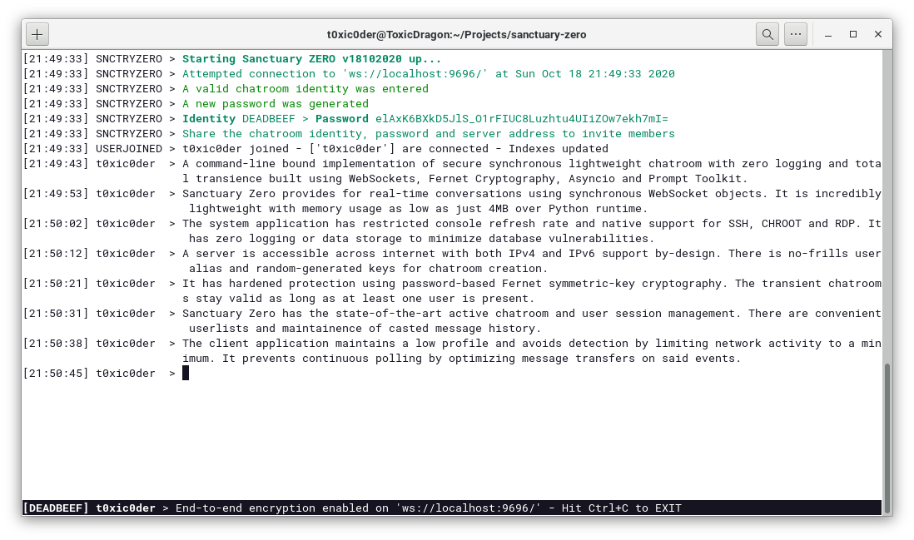

<h1 align="center">sanctuary-zero</h1>

A command-line bound implementation of secure synchronous lightweight chatroom with zero logging and total transience built using WebSockets, Fernet Cryptography, Asyncio and Prompt Toolkit

    
    
    
    

## Good news!
This project is now listed in the list of [Projects using Python Prompt Toolkit](https://github.com/prompt-toolkit/python-prompt-toolkit).

## Features
1.  Provides real-time conversation using synchronous WebSocket objects
2.  Incredibly lightweight with memory usage as low as just 4MB over Python runtime
3.  Restricted console refresh rate and native support for SSH, CHROOT and RDP
4.  Zero logging or data storage to minimize database vulnerabilities
5.  Accessible across internet with both IPv4 and IPv6 support by-design
6.  No-frills user alias and random-generated keys for chatroom creation
7.  Hardened protection using password-based Fernet symmetric-key cryptography
8.  Transient chatrooms stay valid as long as at least one user is present
9.  State-of-the-art active chatroom and user session management
10. Convenient userlist and casted message history maintenance
11. Maintain low profile and avoid detection by limiting network activity to a minimum
12. Prevent continuous polling by optimizing message transfers on said events

## Looks exciting?
Jump right into the project wiki to know more about it.
1. [Home](https://github.com/t0xic0der/sanctuary-zero/wiki)
2. [Client setup](https://github.com/t0xic0der/sanctuary-zero/wiki/Client-setup)
3. [Server setup](https://github.com/t0xic0der/sanctuary-zero/wiki/Server-setup)
4. [Fernet Cryptography](https://medium.com/asecuritysite-when-bob-met-alice/passing-encrypted-tokens-the-fernet-way-ef9b2a9d125d)
5. [Contributors](https://github.com/t0xic0der/sanctuary-zero/graphs/contributors)

## Platforms supported
1. GNU/Linux (Tested on Arch Linux, Fedora 32, Ubuntu 20.04)
2. Microsoft Windows (Tested on Windows 10 Build 1909)

## Screenshots
### Server

### Client

